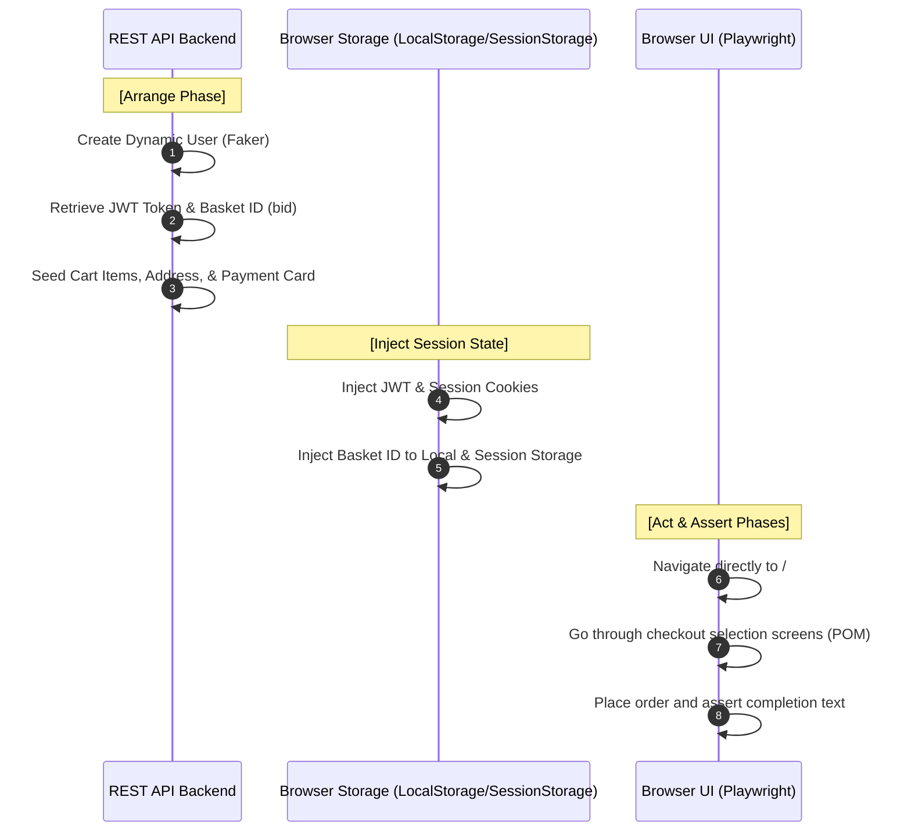

# 🚀 SDET Automation Framework - Hybrid Architecture (UI & API)

[](https://playwright.dev/)
[](https://www.typescriptlang.org/)
[](https://zod.dev/)
[](https://www.docker.com/)

A high-performance, industry-grade test automation framework designed under strict software engineering principles for both UI and API layers. Built using **TypeScript**, **Playwright**, and **Zod**, this repository showcases how to bypass traditional, slow, and flaky UI steps by combining background REST API mutations with state injection.

---

## 🏛️ Hybrid Test Architecture Flow

To maximize test execution speed and completely eliminate UI flakiness (such as logging in, navigating complex search grids, and filling multiple forms), this framework adopts a **hybrid automation pattern**:



---

## 📂 Framework Directory Structure

```text
sdet-roadmap-playwright/
├── src/
│   ├── api/                  # REST API Clients (Decoupled Layer)
│   │   ├── AddressClient.ts
│   │   ├── BasketClient.ts
│   │   ├── CardClient.ts
│   │   ├── ProductClient.ts
│   │   └── UserClient.ts
│   ├── factories/            # Object Mother / Test Data Generation
│   │   └── userFactory.ts
│   ├── fixtures/             # Custom Playwright Fixtures
│   │   └── juiceTest.ts
│   ├── pages/                # Page Object Model (POM)
│   │   └── JuiceShopPage.ts
│   ├── schemas/              # Zod API Contract Schemas
│   │   ├── address.schema.ts
│   │   ├── basket.schema.ts
│   │   ├── card.schema.ts
│   │   ├── common.schema.ts  # Shared date formatting validators
│   │   └── product.schema.ts
│   └── types/                # Inferred TypeScript Types
│       ├── address.types.ts
│       ├── basket.types.ts
│       ├── card.types.ts
│       └── product.types.ts
├── tests/
│   ├── api/                  # Isolated API Contract & Functional Tests
│   │   └── user.api.spec.ts
│   ├── snapshots/            # Centralized Visual Regression Baseline Images
│   │   └── *.png
│   └── ui/                   # UI, Hybrid & Visual Test Specs
│       ├── juice-checkout.spec.ts
│       ├── juice-hybrid.spec.ts
│       └── juice-visual.spec.ts
├── playwright.config.ts      # Global Test configuration runner
└── tsconfig.json             # TypeScript compiler rules
```

---

## 🧠 Key Design Patterns & Technical Highlights

### 1. Multi-Storage Session Injection (Bypassing Login Forms)
Before launching the browser page, Playwright's `addInitScript` injects the seeded API authentication state and dismisses popup flags globally in a single block. Since Angular Material reads state across multiple storages, we inject values into both `localStorage` and `sessionStorage` simultaneously:

```typescript
async injectSessionToken(token: string, bid: string | number): Promise<void> {
  await this.page.addInitScript(
    ({ jwtToken, basketId }) => {
      window.localStorage.setItem("token", jwtToken);
      window.localStorage.setItem("bid", String(basketId));
      window.sessionStorage.setItem("bid", String(basketId));
      document.cookie = "welcomebanner_status=dismiss; path=/";
      document.cookie = "cookieconsent_status=dismiss; path=/";
    },
    { jwtToken: token, basketId: bid }
  );
}
```

### 2. Semantic & Resilient Accessibility Locators (A11y)
Modern Material UIs dynamically change element accessibility names (ARIA labels) between steps (e.g., from `"Proceed to payment"` to `"Proceed to review"`). Rather than using fragile tag paths, we couple standard ARIA roles with visible text filtering to construct bulletproof selectors:

```typescript
// Resilient locator targeting the step button by its actual human-visible text
this.continueButton = page.getByRole("button").filter({ hasText: "Continue" });
```

### 3. DRY Zod Contract Extensions
Rather than duplicating fields between API payloads (POST request) and server responses (which append properties like `id`, `UserId`, `createdAt`), Zod's `.extend()` modifier is used to maintain schemas dynamically from a single source of truth:

```typescript
export const juiceCardSchema = juiceAddCardPayloadSchema.extend({
  id: z.number().positive(),
  UserId: z.number().positive(),
  createdAt: dateStringSchema,
  updatedAt: dateStringSchema,
});
```

---

## 🛠️ Local Setup & Execution

### Prerequisites

Ensure you have [Docker Desktop](https://www.docker.com/products/docker-desktop/) installed and running.

Clone the repository and install dependencies:
```bash
npm install
```

Configure your environment variables inside a `.env` file in the root directory:
```env
API_URL=http://localhost:3000
UI_URL=http://localhost:3000
```

### 🐳 Docker Container Control
Manage the local **OWASP Juice Shop** container environment using simple npm scripts:
```bash
# Start the local Docker container (auto-pulls image if missing)
npm run docker:start

# View live container logs in real-time
npm run docker:logs

# Stop the container
npm run docker:stop
```

### 🧪 Test Execution Dashboard

Ensure the docker container is running, then choose your execution scope:

```bash
# Run the complete test suite (API, UI, and Hybrid E2E specs)
npm test

# Run isolated API contract validation and mutation tests
npm run test:api

# Run UI and Hybrid tests in Chromium
npm run test:ui

# Run cross-browser compatibility tests (Chromium, Firefox, WebKit) in parallel
npm run test:ui:crossbrowser

# Run visual execution mode (Playwright UI Runner)
npm run test:ui:visual

# View consolidated Playwright HTML report
npm run report
```

### 🧹 Code Quality (Linter)
Validate code syntax and structural guidelines against our strict ESLint ruleset:
```bash
npm run lint
```

---

*This framework stands as a core milestone in the professional journey toward Software Development Engineer in Test (SDET), demonstrating modern software engineering applied to test automation.*
