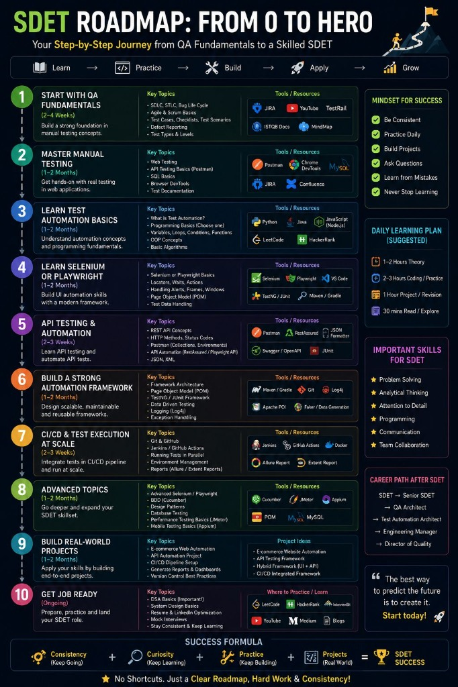

# 📘 LOGBOOK & BACKUP - SDET JOURNEY

> **Context Instruction:** This file serves as the central, linear memory of my career transition to SDET. It must be kept updated incrementally with each technical mentorship session conducted in the Antigravity IDE.

---

## 1. Incremental Update Prompt (End of Session)

Whenever you finish a technical discussion, bug resolution, or test architecture design, copy the prompt below, paste it into the IDE chat, and send it:

```prompt
Open the @sdet_journey.md file and add a new section at the end of it with the summary of our current conversation. Strictly follow this Markdown template for the new section:

## [Today's Date] - [Subject Title]
### 1. Scenario and Technical Challenge
[Insert the summary of the problem we solved here]
### 2. Structured Solution & Recommended Patterns
[Insert the code blocks and architecture we consolidated here]
### 3. Next Study Steps
[Insert the immediate action plan here]

Keep the rest of the file intact and just append this new section.
```

## 2. Git Versioning Flow (Post-Session)

After the AI confirms it has saved the new section to the file, open your personal repository terminal and run the following commands to secure your progress in the cloud:

```bash
git add sdet_journey.md
git commit -m "docs: add mentorship about [Today's Subject] to the logbook"
git push origin main
```

---

## 3. Official SDET Roadmap Reference

Here is the visual roadmap we are following for this career transition:



---

## 06/07/2026 - Mentorship History Consolidation (Origin: WebApp)

### 1. Scenario and Technical Challenge

The journey began with the goal of making a career transition from **QA Automation Engineer** to **SDET (Software Development Engineer in Test)**, focusing on upgrading isolated functional tests to a production-grade robust architecture. Initially, we worked with a linear, procedural UI test script (`tests/ecommerce.spec.ts`) targeting the SauceDemo e-commerce website.

During the evolution of the project, we faced the following engineering challenges:

- **OOP & Encapsulation Paradigm:** Moving away from sequential scripts to structure reusable classes with private and strongly typed element selectors (`Locator`).
- **Ambiguity and Hardcoded Data:** Dealing with duplicate selectors in the shopping cart and the risk of silent failures due to hardcoded product strings in the UI.
- **TypeScript Compilation Errors:** Fixing recurring scope errors and missing imports (such as the `expect` object).
- **Setup and Execution Speed (Login Bypass):** Avoiding having to run the login flow in every individual UI test, which significantly increased test execution time.
- **Hybrid Environment Isolation (API & UI):** Preventing API tests from leaking context or failing due to a lack of an appropriate `baseURL`, or rejection due to the absence of authentication headers required by the ReqRes WAF.
- **Module Conflict (CommonJS vs ESM):** Resolving compilation issues when integrating the modern `@faker-js/faker` package (ESM) into a project configured with CommonJS.

### 2. Structured Solution & Recommended Patterns

To solve these technical challenges and build the foundation of a professional framework, we implemented the following architectural solutions:

- **Dynamic Page Object Model (POM):** Centralizing locators in the constructor of classes like `LoginPage` and `ProductsPage`. We used regular expressions (kebab-case `Regex`) to dynamically map human-readable product names to HTML `data-test` identifiers, resolving element collisions:
  ```ts
  const formattedName = productName.toLowerCase().replace(/\s+/g, "-");
  const productButton = this.page.getByTestId(`add-to-cart-${formattedName}`);
  await productButton.click();
  ```
- **Locator Centralization & Chaining:** Chaining locators from filtered scopes in POM to reuse class properties and mitigate failures due to layout changes:
  ```ts
  const scopedItemContainer = this.cartItemContainer.filter({
    hasText: productName,
  });
  const itemNameLocator = scopedItemContainer.locator(this.productItemName);
  await itemNameLocator.waitFor({ state: "visible" });
  ```
- **Dependency Injection with Custom Fixtures:** We extended Playwright's native test engine (`base.extend`) in `src/fixtures/baseTest.ts` to automatically initialize the login and products pages, eliminating instantiation boilerplate in every test file:
  ```ts
  export const test = base.extend<MyFixtures>({
    loginPage: async ({ page }, use) => {
      await use(new LoginPage(page));
    },
    productsPage: async ({ page }, use) => {
      await use(new ProductsPage(page));
    },
  });
  ```
- **Session-State Bypass (Global Authentication):** Configuring a global setup (`tests/global.setup.ts`) to authenticate the user and save the session state to `.auth/user.json`. UI projects reuse this state dynamically, optimizing the overall execution time.
- **Strict Project Isolation (`playwright.config.ts`):** A clear division in the Playwright configuration file, surgically binding the `testDir` to `./tests/api` and `./tests/ui` subfolders to prevent worker overlap.
- **HTTP Client Refactoring (`UserClient.ts`):** Centralizing routes with relative paths in the HTTP client class and correctly handling headers (`Content-Type`, `x-api-key`) for API integration tests.
- **Dynamic Data Factory (`UserFactory.ts`):** Implementing factories with dynamic asynchronous imports (`await import('@faker-js/faker')`) to bypass module compatibility issues and ensure a unique dataset for each run.
- **Network Mocking & Resilience:** UI tests intercepting requests with mocks to validate resilient frontend behavior in the face of critical failures (HTTP 500), dynamic static asset replacement, and network latency simulation (Slow 3G).

### 3. Next Study Steps

- **CI/CD Pipeline in GitHub Actions:** Develop and implement the `.github/workflows/pipeline.yml` file for parallel headless execution on GitHub's Linux runners.
- **Secure Secrets Management:** Configure repository secrets (`API_URL`, `UI_URL`, `REQRES_API_KEY`) to run tests securely in the cloud.
- **Expanding Data Factories:** Create new dynamic object factories and apply the pattern more broadly across the framework.
- **Reporting & Debugging Best Practices:** Configure robust HTML reports in CI for fast troubleshooting of failures.

---

## 08/07/2026 - Advanced CI/CD Pipeline Optimization (Parallel Jobs & Blob Merge)

### 1. Scenario and Technical Challenge

The initial GitHub Actions pipeline (`pipeline.yml`) ran all tests sequentially, installing browser binaries for all execution contexts. This caused a time bottleneck in API test executions (which do not require browsers) and created fragmented HTML reports that were difficult to audit when running in parallel jobs. Additionally, a version mismatch was identified in the Dockerfile base image (`1.49.0` vs. `1.61.0` of the framework) and bugs referencing non-existent projects in the `npm run test:ui:crossbrowser` script of `package.json`.

### 2. Structured Solution & Recommended Patterns

We developed a high-efficiency restructuring in the CI/CD pipeline:

- **Container Synchronization:** Updated the [Dockerfile](https://github.com/RaphaelCarvalho07/sdet-roadmap-playwright/blob/main/Dockerfile) to sync with the official `playwright:v1.61.0-noble` image.
- **Mapping Correction:** Adjusted the `test:ui:crossbrowser` script in [package.json](https://github.com/RaphaelCarvalho07/sdet-roadmap-playwright/blob/main/package.json) to mirror the exact definitions of `playwright.config.ts`.
- **Parallel Execution Jobs (Split API & UI):** We created distinct asynchronous jobs in [.github/workflows/pipeline.yml](https://github.com/RaphaelCarvalho07/sdet-roadmap-playwright/.github/workflows/pipeline.yml):
  - API test job without the overhead of browser installation.
  - UI test job installing dependencies required only for its scope.
- **Report Consolidation via Blob Merge:** Both test jobs generate lightweight binary blob reports (`--reporter=blob`), which are combined in a final job executing `npx playwright merge-reports`.
- **Automated Deploy to GitHub Pages:** The final job automatically publishes the consolidated HTML report to GitHub Pages (`gh-pages` branch), providing a direct web link.

### 3. Next Study Steps

- **Advanced Data Generation Phase (Option B):** Begin the study of complex data generation patterns (Object Mother, seeding via API requests to prepare UI scenarios).
- **CI Flakiness Handling:** Study retry strategies and detection of flaky tests in the pipeline.

---

## 10/07/2026 - Checkout Flow Automation & Object Mother Implementation

### 1. Scenario and Technical Challenge

The goal was to automate the checkout flow of the SauceDemo UI application and improve test data management by introducing dynamic data generation. The main challenges were:

- Mapping consecutive multi-step checkout pages (`/cart.html`, `/checkout-step-one.html`, `/checkout-step-two.html`, and `/checkout-complete.html`) in a clean, encapsulated way.
- Generating structured test data dynamically with Faker while avoiding code duplication and ESM vs CommonJS conflicts.
- Structuring predefined test data states (valid profiles and invalid profiles missing specific fields) to support both positive and negative scenarios without cluttering test code.
- Unpacking asynchronous TypeScript `Promise` return types correctly within test scopes using `async/await`.

### 2. Structured Solution & Recommended Patterns

We designed a decoupled architecture containing the following components:

- **Type Interfaces:** Defined `CheckoutPayload` type inside [checkout.types.ts](https://github.com/RaphaelCarvalho07/sdet-roadmap-playwright/blob/main/src/types/checkout.types.ts) to enforce a strong billing data contract.
- **Page Object Model (POM):** Created [CheckoutPage.ts](https://github.com/RaphaelCarvalho07/sdet-roadmap-playwright/blob/main/src/pages/CheckoutPage.ts) encapsulating locators (`getByTestId`), navigation transitions, and form validation assertions (`validateErrorMessage` and `validateCheckoutComplete`).
- **Fixture Registration:** Extended the Playwright test runner in [baseTest.ts](https://github.com/RaphaelCarvalho07/sdet-roadmap-playwright/blob/main/src/fixtures/baseTest.ts) to automatically inject `checkoutPage` into tests, avoiding manual instantiation.
- **Object Mother Pattern:** Implemented [checkoutFactory.ts](https://github.com/RaphaelCarvalho07/sdet-roadmap-playwright/blob/main/src/factories/checkoutFactory.ts) using dynamic imports of `@faker-js/faker` to prevent module conflicts. The factory offers specific pre-configured object states for tests:

  ```ts
  export class CheckoutFactory {
    static async createValidCheckoutData(): Promise<CheckoutPayload> {
      const { faker } = await import("@faker-js/faker");
      return {
        firstName: faker.person.firstName(),
        lastName: faker.person.lastName(),
        postalCode: faker.location.zipCode(),
      };
    }

    static async createCheckoutDataWithMissingFirstName(): Promise<CheckoutPayload> {
      const data = await this.createValidCheckoutData();
      data.firstName = "";
      return data;
    }
  }
  ```

- **Test Scenarios:** Created [checkout.spec.ts](https://github.com/RaphaelCarvalho07/sdet-roadmap-playwright/blob/main/tests/ui/checkout.spec.ts) executing positive (successful purchase) and negative (validation failure) checkout scenarios leveraging auth bypass and the Object Mother data states.

### 3. Next Study Steps

- **Data Seeding via API:** Learn how to create state and seed entities using API requests inside UI tests before actions.
- **Advanced Assertions:** Expand form validation tests to cover all other billing fields (missing last name, missing postal code) and assert the correct validation warning styling.

---

## 13/07/2026 - Advanced POM Assertions & Data-Driven UI Test Refactoring

### 1. Scenario and Technical Challenge

We expanded the checkout validation tests to cover all required fields (Last Name, Postal Code) and verify the visual error feedback (CSS styling changes on input fields). The key technical challenges resolved were:

- **Avoiding False Positives in CSS Matchers:** The base class of the input fields is `input_error`, which contains the word `error`. A naive class match like `/error/` would always pass. We resolved this by applying a Regex Word Boundary (`\b`) to match only the standalone `.error` class.
- **Refactoring Repetitive Tests (DRY Principle):** Instead of duplicating identical UI steps across three negative test cases, we refactored the test suite into a single loop using a data-driven structure.
- **Formulating Composite Assertions:** To satisfy the Single Responsibility Principle, we created a high-level composite method inside the Page Object to orchestrate both error message validation and input highlight checks.

### 2. Structured Solution & Recommended Patterns

We refactored the page object and test suite as follows:

- **Regex Boundary Matcher:** In [CheckoutPage.ts](https://github.com/RaphaelCarvalho07/sdet-roadmap-playwright/blob/main/src/pages/CheckoutPage.ts), we updated `validateInputErrorState` to use `/\berror\b/` and introduced the composite method `validateFieldError`:

  ```ts
  async validateInputErrorState(fieldName: string): Promise<void> {
    const input = this.page.getByTestId(fieldName);
    await expect(input).toBeVisible();
    await expect(input).toHaveClass(/\berror\b/);
  }

  async validateFieldError(fieldName: string, expectedMessage: string): Promise<void> {
    await this.validateErrorMessage(expectedMessage);
    await this.validateInputErrorState(fieldName);
  }
  ```

- **Data-Driven Loop:** In [checkout.spec.ts](https://github.com/RaphaelCarvalho07/sdet-roadmap-playwright/blob/main/tests/ui/checkout.spec.ts), we defined a scenario matrix and iterated over it using a `for...of` loop to dynamically register tests:

  ```ts
  const validationScenarios = [
    {
      field: "firstName",
      factoryMethod: "createCheckoutDataWithMissingFirstName" as const,
      expectedMessage: "Error: First Name is required",
    },
    {
      field: "lastName",
      factoryMethod: "createCheckoutDataWithMissingLastName" as const,
      expectedMessage: "Error: Last Name is required",
    },
    {
      field: "postalCode",
      factoryMethod: "createCheckoutDataWithMissingPostalCode" as const,
      expectedMessage: "Error: Postal Code is required",
    },
  ];

  for (const scenario of validationScenarios) {
    test(`should display validation error and highlight input when ${scenario.field} is missing`, async ({
      productsPage,
      checkoutPage,
    }) => {
      await productsPage.addProductToCart(productName);
      await productsPage.goToCart();
      await checkoutPage.startCheckout();

      const invalidData = await CheckoutFactory[scenario.factoryMethod]();
      await checkoutPage.fillInformation(
        invalidData.firstName,
        invalidData.lastName,
        invalidData.postalCode,
      );
      await checkoutPage.validateFieldError(
        scenario.field,
        scenario.expectedMessage,
      );
    });
  }
  ```

### 3. Next Study Steps

- **Data Seeding via API:** Explore hybrid testing where we populate application state directly through HTTP requests before initiating UI scenarios.
- **Handling Flaky Tests:** Implement Playwright retries and trace-captures to identify transient environment timeouts.

---

## 14/07/2026 - SMART Goal Alignment & CI Pipeline Upgrades

### 1. Scenario and Technical Challenge

- **Career and Study Goal Setting:** Established a tailored 90-day SMART transition plan to SDET, allocating a realistic 10h/week schedule (6h technical practice in the IDE, 4h career boosting/LinkedIn) during weekday working hours. Family time (with 3 daughters) and work-life balance are defined as non-negotiable core values, leaving weekends 100% offline.
- **Node.js Deprecation Warning in GHA:** The GitHub Actions runner emitted a deprecation warning because jobs were targeting Node.js 20. We resolved this infrastructure debt by upgrading all pipeline jobs to Node.js 22 (Active LTS).

### 2. Structured Solution & Recommended Patterns

We updated the following files:

- **GitHub Actions Configuration:** Modified [.github/workflows/pipeline.yml](https://github.com/RaphaelCarvalho07/sdet-roadmap-playwright/blob/main/.github/workflows/pipeline.yml) across all 4 jobs (`lint`, `api-tests`, `ui-tests`, and `publish-report`) to set `node-version: 22` and added a `📝 Output Pages URL to Job Summary` step to output the live report link directly to the run summary for enhanced developer experience.
- **SMART Goals Framework:** Created [sdet_smart_goals.md](file:///Users/raphaelcarvalho/.gemini/antigravity-ide/brain/a811e423-b909-4864-8f4e-91c6ba5cc971/sdet_smart_goals.md) in the artifacts repository to guide study sprints and candidate application cycles.

### 3. Next Study Steps

- **API Contract Testing (Zod/AJV):** Replace manual property type assertions with schema-based contract validation to verify full payload integrity.
- **Data Seeding via API:** Implement hybrid test scenarios making background HTTP calls using the API client to set application state before UI execution.
- **Flakiness Mitigation:** Research retry configurations and trace capturing on test failures to optimize pipeline execution under heavy CPU loads.
- **Performance Testing with K6:** Write API load-test scripts in JavaScript/TypeScript using the K6 engine to simulate high user concurrency.
- **Mobile Automation (Android & iOS):** Explore Appium integrated with TypeScript/WebdriverIO to maintain our programming stack while testing native apps.
- **Visual Regression Testing:** Integrate screenshot layout comparisons using Playwright's native visual assertions.

---

## 17/07/2026 - API Contract Testing with Zod 4

### 1. Scenario and Technical Challenge

- **Manual API Validations:** The existing API test suite verified responses using individual manual properties checks (e.g. `typeof id === 'number'`), which was verbose, hard to maintain, and did not guarantee full contract compliance.
- **Strict Data and Contract Validation:** We transitioned to structural contract validation using Zod 4. The main challenge was to design clean schemas matching the ReqRes API and infer TypeScript types from them to avoid duplication.

### 2. Structured Solution & Recommended Patterns

We implemented the following solutions:

- **Zod 4 Schemas:** Created [user.schema.ts](https://github.com/RaphaelCarvalho07/sdet-roadmap-playwright/blob/main/src/schemas/user.schema.ts) grouping validators. Utilized Zod 4 top-level format validators (`z.url()`, `z.email()`) and namespace schema validators (`z.iso.datetime()`).
- **Dynamic Type Inference:** Refactored [user.types.ts](https://github.com/RaphaelCarvalho07/sdet-roadmap-playwright/blob/main/src/types/user.types.ts) to export types inferred dynamically via `z.infer<typeof schema>`, establishing a single source of truth.
- **Contract Spec Refactoring:** Updated [user.api.spec.ts](https://github.com/RaphaelCarvalho07/sdet-roadmap-playwright/blob/main/tests/api/user.api.spec.ts) replacing manual asserts with `.parse()` validation.

### 3. Next Study Steps

- **Data Seeding via API:** Implement hybrid test scenarios making background HTTP calls using the API client to set application state before UI execution.
- **Flakiness Mitigation:** Research retry configurations and trace capturing on test failures to optimize pipeline execution under heavy CPU loads.
- **Performance Testing with K6:** Write API load-test scripts in JavaScript/TypeScript using the K6 engine to simulate high user concurrency.
- **Mobile Automation (Android & iOS):** Explore Appium integrated with TypeScript/WebdriverIO to maintain our programming stack while testing native apps.
- **Visual Regression Testing:** Integrate screenshot layout comparisons using Playwright's native visual assertions.
- **Test Observability & Telemetry:** Implement correlation IDs (x-request-id/traceparent), structured JSON logging, and test execution metrics to link automated test runs with APM/backend observability tools (Datadog/Grafana).

---

## 20/07/2026 - OWASP Juice Shop Migration & Real REST API Testing

### 1. Scenario and Technical Challenge

- **Transition to Production-Grade Target:** Shifted our testing target from static mock platforms (SauceDemo/ReqRes) to a real, containerized Full-Stack application: **OWASP Juice Shop** (Angular SPA + Node.js/Express REST API + SQLite DB).
- **Environment Orchestration:** Launched Juice Shop locally via Docker (`bkimminich/juice-shop`) on port 3000 and updated local environment settings (`.env`).
- **REST API & Authentication Exploration:** Explored Juice Shop's REST endpoints (`POST /api/Users/` and `POST /rest/user/login`) using terminal `cURL` probing to inspect live HTTP status codes, headers, and JSON payloads.

### 2. Structured Solution & Recommended Patterns

We implemented the following architecture changes:
- **Zod 4 Schemas:** Created [user.schema.ts](https://github.com/RaphaelCarvalho07/sdet-roadmap-playwright/blob/main/src/schemas/user.schema.ts) defining strict schemas for Juice Shop registration and JWT authentication responses (`juiceUserRegistrationResponseSchema` and `juiceUserLoginResponseSchema`).
- **Dynamic Type Inference:** Updated [user.types.ts](https://github.com/RaphaelCarvalho07/sdet-roadmap-playwright/blob/main/src/types/user.types.ts) using `z.infer` to maintain a single source of truth.
- **Factory & HTTP Client:** Updated [userFactory.ts](https://github.com/RaphaelCarvalho07/sdet-roadmap-playwright/blob/main/src/factories/userFactory.ts) with `@faker-js/faker` generating valid dynamic payloads, and updated [UserClient.ts](https://github.com/RaphaelCarvalho07/sdet-roadmap-playwright/blob/main/src/api/UserClient.ts) targeting `/api/Users/` and `/rest/user/login`.
- **API Spec Execution:** Updated [user.api.spec.ts](https://github.com/RaphaelCarvalho07/sdet-roadmap-playwright/blob/main/tests/api/user.api.spec.ts). Executed suite against local Docker container: **2 passed in 438ms**.

### 3. Next Study Steps

- **Data Seeding via API:** Implement hybrid test scenarios making background HTTP calls using the API client to set application state and inject JWT session tokens before UI execution on OWASP Juice Shop.
- **Flakiness Mitigation:** Research retry configurations and trace capturing on test failures to optimize pipeline execution under heavy CPU loads.
- **Performance Testing with K6:** Write API load-test scripts in JavaScript/TypeScript using the K6 engine against local Juice Shop container to simulate high user concurrency.
- **Mobile Automation (Android & iOS):** Explore Appium integrated with TypeScript/WebdriverIO to maintain our programming stack while testing native apps.
- **Visual Regression Testing:** Integrate screenshot layout comparisons using Playwright's native visual assertions.
- **Test Observability & Telemetry:** Implement correlation IDs (x-request-id/traceparent), structured JSON logging, and test execution metrics to link automated test runs with APM/backend observability tools (Datadog/Grafana).
